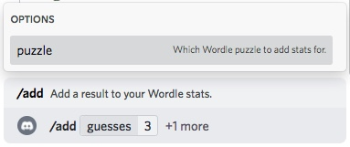
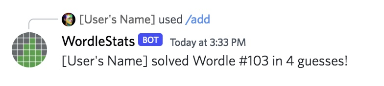

# Add Score
Adds a new Wordle score to your stats, or changes the score you have saved if you've already
provided a score for the given puzzle.

## Command

### `/add [puzzle] [guesses]`

## Options
| Option | Type | Required | Description |
| --- | --- | --- | --- |
| puzzle | integer | Yes | The unique puzzle number to add a score to. |
| guesses | multiple choice | Yes | The number of guesses it took you to solve the Wordle, or "Unsolved" if you did not solve it. |

## Example Usage

