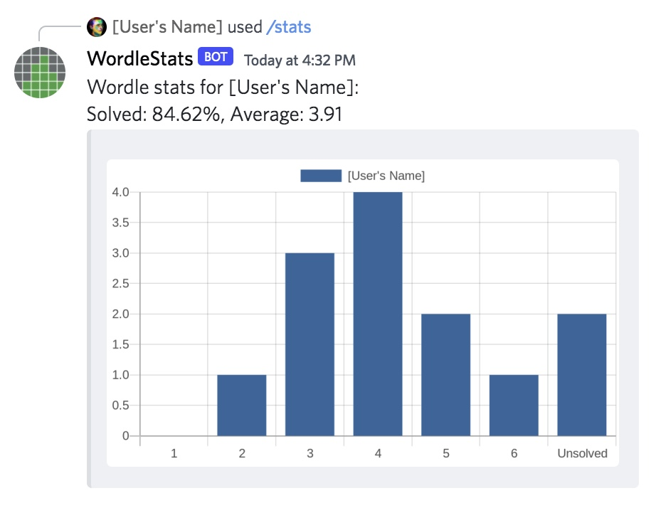

# Stats
Displays the latest Wordle statistics for a given user. Currently, the following statistics are provided:
- Percentage of puzzles solved
- Average number of guesses for solved puzzles
- A bar chart showing distribution of scores

## Command

### `/stats [user]`

## Options
| Option | Type | Required | Description |
| --- | --- | --- | --- |
| user | user | No | The user to display stats for. If no user option is provided, the stats are instead displayed for the caller of the command. |

## Example Usage

